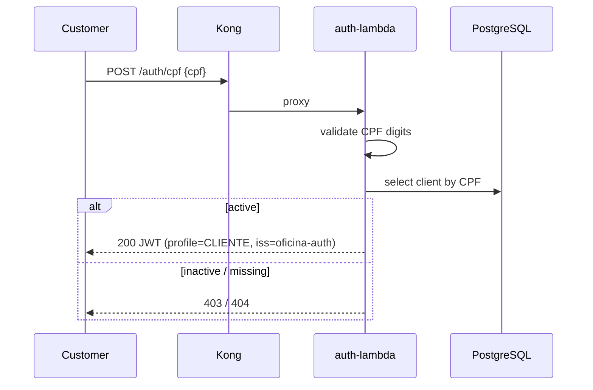

# Oficina — Serverless Functions (Auth + Notifications)

Python functions with an AWS Lambda handler contract, executed locally as containers
behind Kong. The same `handler(event, context)` can be deployed to AWS Lambda later.

## Purpose

1. Authenticate a customer by CPF, check existence/status, issue a JWT
2. Receive work-order events and send email (MailHog locally, SES in the cloud)

## Technologies

Python 3.12, FastAPI, PyJWT (HS512), psycopg, pytest, Docker, GitHub Actions.

## Architecture



## Local run

```bash
python -m venv .venv
.venv/Scripts/activate
pip install -r requirements-dev.txt
pytest -q
docker build -f Dockerfile.auth -t oficina-auth-lambda:latest .
docker build -f Dockerfile.notify -t oficina-notify-lambda:latest .
```

Compose (with the API stack) or Kubernetes:

```bash
kind load docker-image oficina-auth-lambda:latest --name oficina-cluster
kind load docker-image oficina-notify-lambda:latest --name oficina-cluster
kubectl apply -f k8s/
```

## API contract

`POST /auth/cpf`

```json
{ "cpf": "529.982.247-25" }
```

Successful response: `accessToken`, `profile=CLIENTE`, `clientId`.

Use the token on protected `/api/*` routes through Kong (`Authorization: Bearer`).

Swagger of the main API: http://localhost:8000/swagger-ui.html (via Kong) or
http://localhost:8080/swagger-ui.html (direct).

## CI/CD

PR and push: pytest + Docker build. Push to `homolog`/`main` also loads images into kind
and applies manifests.

Protect `main` with required pull requests.

## Related repositories

- https://github.com/Nicholasspoltidesouza/Fiap-Pos-Tech-Challenge-infra-k8s
- https://github.com/Nicholasspoltidesouza/Fiap-Pos-Tech-Challenge-infra-db
- https://github.com/Nicholasspoltidesouza/Fiap-Pos-Tech-Challenge-1
